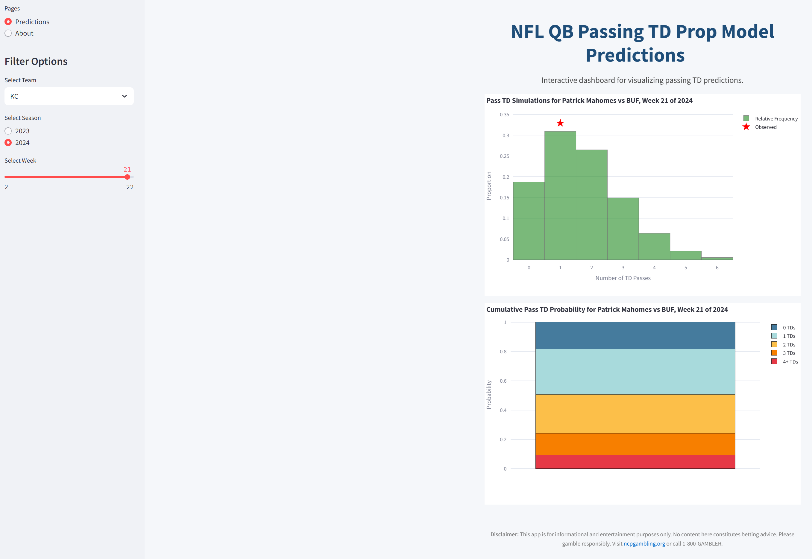
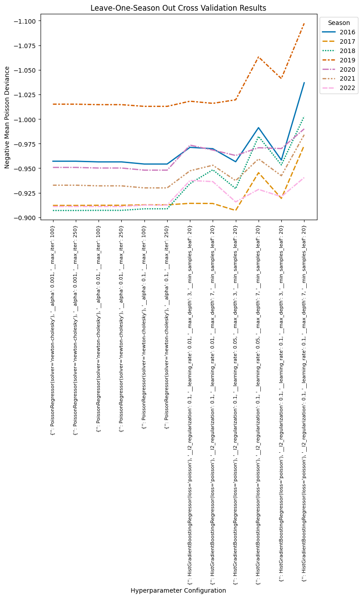
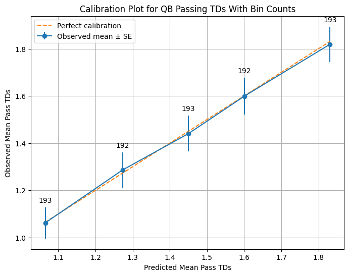
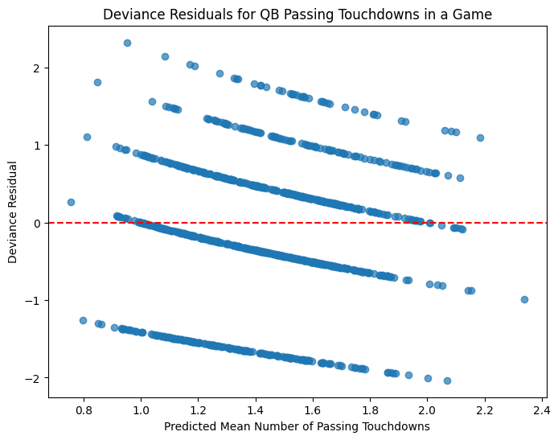

# PassLine 🏈

## Overview
This project applies machine learning to predict the number of passing touchdowns an NFL quarterback (QB) will throw in his next game. The model is deployed in a Streamlit app aimed at fans, bettors, and sports analytics enthusiasts.

## Purpose 
1. During the season, this app will be deployed in the cloud and display expected values of QB passing TD props to guide bettors.
2. It also provides an interface to visualize model predictions for QB passing TD performances since 2023.

## Application Snapshot
**Model prediction for Patrick Mahomes against the Buffalo Bills in the 2024 AFC Championship**




## Model Development
Data was primarily sourced from nflverse. The modeling pipeline includes extensive feature engineering, such as exponentially-weighted moving averages and contextual game features (e.g., implied point totals and weather forecasts). A Poisson generalized linear model was compared with a gradient-boosted tree model optimized with a Poisson loss function. Model selection and hyperparameter tuning were performed using leave-one-season-out cross-validation, with evaluation based on the mean Poisson deviance.

See [`notebooks`](./notebooks) for exploratory data analysis, model evaluation, and bootstrapping results.

## Model Evaluation

Visualizations assessing model performance and fit are below.







## Getting Started
1. Install UV:
```bash
curl -LsSf https://astral.sh/uv/install.sh | sh
```

2. Clone the GitHub repo:
```bash
git clone https://github.com/bochnerjacob/PassLine
```

3. Navigate to the directory:
```bash
cd PassLine
```

4. Create a virtual environment, activate it, and install packages:
```bash
uv venv
source .venv/bin/activate
uv pip install -r pyproject.toml
```

5. Navigate to scripts and open app.py:
```bash
cd scripts
```

6. Change <YOUR_DATASETS_DIRECTORY> in the import statement near the top of the script to your local path.

7. Save app.py, exit, and run:
```bash
streamlit run app.py
```

## Project Structure
```bash
datasets/:
    qb_bootstrap_results.parquet
    qb_test_true_pred.parquet
    qb_X_test.parquet
    qb_X_train.parquet
    qb.parquet

models/:
    qb_poisson_model.skops

notebooks/:
    preprocess_engineer_features.ipynb
    cross_validation.ipynb
    simulations.ipynb

scripts/:
    app.py
    weather.py

utils/:
    nfl_utils.py
```

## Next Steps
1. Incorporate live odds and data from the odds-api into the prediction pipeline for calculating expected values of prop bets.
2. Evaluate the value add of engineering more difficult features.
    - Train a neural network to learn entity embeddings for coach names.
    - Explore more sophistocated ways to measure defensive strength.
3. Fit a mixed model with Bayesian estimation to compare to current approach.
4. Expand beyond QB passing touchdown props.

## License
[MIT](https://choosealicense.com/licenses/mit/)